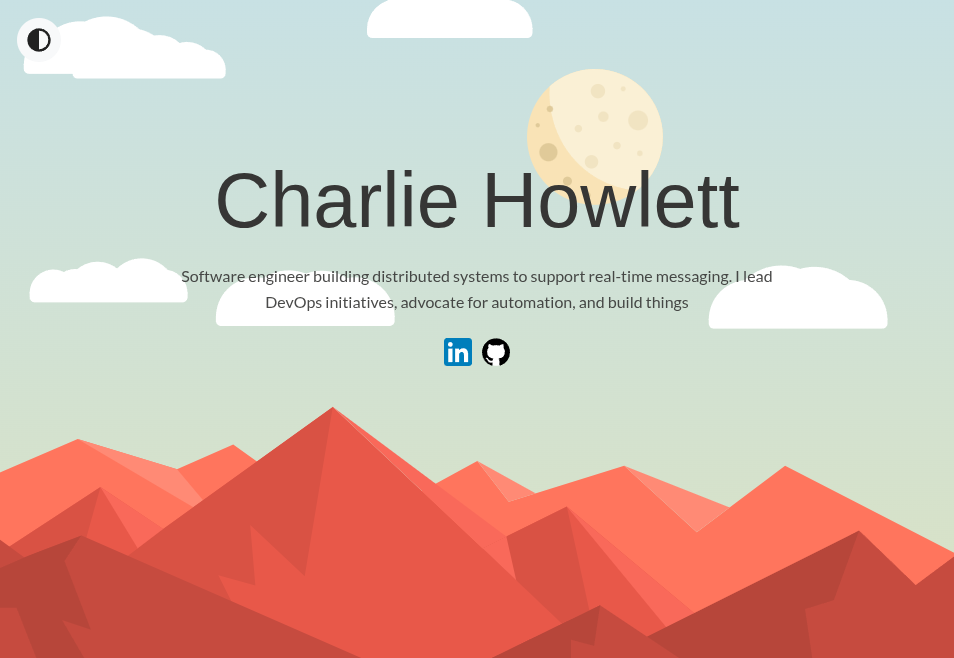
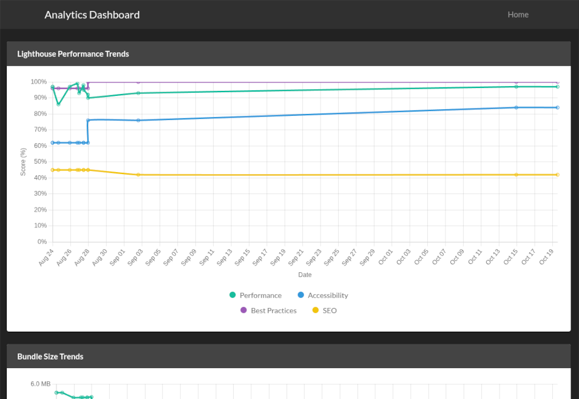

[CharlieHowlett.co.uk](https://charliehowlett.co.uk) hosts my personal website — a static Netlify site that serves as a digital business card. It features my social links and a procedurally generated animated scene originally developed during my university days.

## Analytics

[CharlieHowlett.co.uk/analytics](https://charliehowlett.co.uk/analytics) showcases a custom-built dashboard visualising my site's performance trends over time across various metrics.
This functionality is powered by Netlify Functions and Blob Storage, allowing the main site to remain fully static.

## Technology Stack

- **Vue.js 3**
- **Webpack**
- **Bootstrap**
- **SCSS/SASS**
- **p5.js**
- **Netlify (CDN)**
- **GitHub Actions**